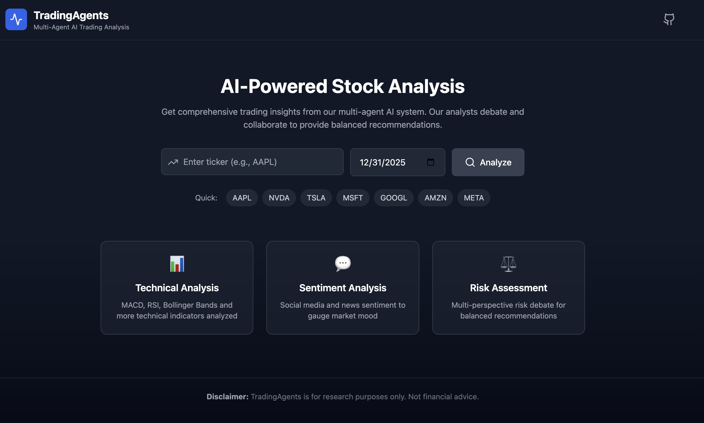
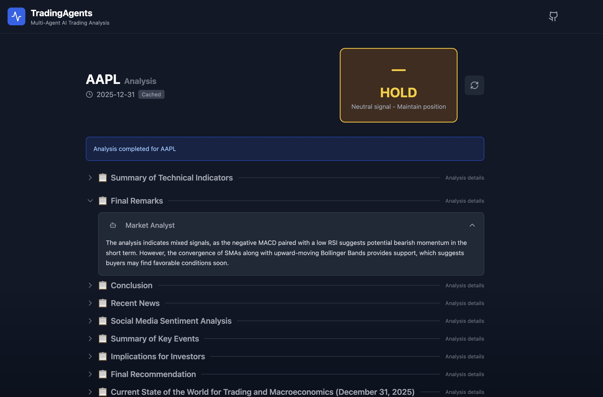

# TradingMind: Multi-Agent LLM Financial Trading Framework

<p align="center">
  
</p>

<p align="center">
  <strong>AI-Powered Stock Analysis with Multi-Agent Collaboration</strong>
</p>

<p align="center">
  <a href="#features">Features</a> •
  <a href="#quick-start">Quick Start</a> •
  <a href="#architecture">Architecture</a> •
  <a href="#usage">Usage</a> •
  <a href="#configuration">Configuration</a>
</p>

---

TradingMind is a multi-agent framework that mirrors real-world trading firms. Specialized LLM-powered agents—analysts, researchers, traders, and risk managers—collaborate through debate to evaluate market conditions and inform trading decisions.

> **Disclaimer:** For research purposes only. Not financial advice.

## Features

| Category | Description |
|----------|-------------|
| **Multi-Agent Analysis** | 4 specialized analysts (Technical, Sentiment, News, Fundamentals) |
| **Bull vs Bear Debate** | Researchers argue opposing viewpoints for balanced insights |
| **Risk Management** | 3-way risk debate (Aggressive, Conservative, Neutral) |
| **Memory & Learning** | ChromaDB-powered system learns from past decisions |
| **Multiple LLMs** | OpenAI, Anthropic Claude, DeepSeek, Google |
| **Web UI + CLI** | Modern React frontend & rich terminal interface |

## Quick Start

```bash
# 1. Install uv (fast Python package manager)
curl -LsSf https://astral.sh/uv/install.sh | sh

# 2. Clone and install
git clone https://github.com/your-repo/tradingmind.git
cd tradingmind
uv sync

# 3. Configure API keys
cp .env.example .env
# Edit .env with your API keys (see Configuration section)

# 4. Run CLI
uv run python -m cli.main

# Or start Web UI (requires two terminals)
uv run python api/main.py          # Terminal 1: Backend
cd frontend && npm i && npm run dev # Terminal 2: Frontend
# Open http://localhost:3000
```

## Architecture

```
User Input (Ticker, Date)
         │
         ▼
┌─────────────────────────────────────────────────────────┐
│                    ANALYST TEAM                         │
│  ┌──────────┐ ┌──────────┐ ┌──────────┐ ┌──────────┐   │
│  │Technical │ │Sentiment │ │   News   │ │Fundamental│   │
│  │ Analyst  │ │ Analyst  │ │ Analyst  │ │ Analyst   │   │
│  └────┬─────┘ └────┬─────┘ └────┬─────┘ └────┬──────┘   │
└───────┼────────────┼────────────┼────────────┼──────────┘
        └────────────┴─────┬──────┴────────────┘
                           ▼
┌─────────────────────────────────────────────────────────┐
│                  RESEARCHER TEAM                        │
│         ┌──────────────┐    ┌──────────────┐           │
│         │     Bull     │◄──►│     Bear     │           │
│         │  Researcher  │    │  Researcher  │           │
│         └──────┬───────┘    └──────┬───────┘           │
│                └───────┬───────────┘                    │
│                      DEBATE                             │
└────────────────────────┼────────────────────────────────┘
                         ▼
┌─────────────────────────────────────────────────────────┐
│                   TRADER AGENT                          │
│        Synthesizes reports → BUY / SELL / HOLD          │
└────────────────────────┼────────────────────────────────┘
                         ▼
┌─────────────────────────────────────────────────────────┐
│               RISK MANAGEMENT TEAM                      │
│    ┌──────────┐   ┌──────────┐   ┌──────────┐          │
│    │Aggressive│   │ Neutral  │   │Conservative│         │
│    └────┬─────┘   └────┬─────┘   └────┬──────┘          │
│         └──────────────┼──────────────┘                 │
│                   RISK DEBATE                           │
└────────────────────────┼────────────────────────────────┘
                         ▼
┌─────────────────────────────────────────────────────────┐
│               PORTFOLIO MANAGER                         │
│           Final Decision + Reasoning                    │
└─────────────────────────────────────────────────────────┘
```

### Agent Roles

| Team | Agent | Responsibility |
|------|-------|----------------|
| **Analysts** | Technical | MACD, RSI, Bollinger Bands analysis |
| | Sentiment | Social media & public sentiment |
| | News | Global news & macro indicators |
| | Fundamentals | Financials, earnings, balance sheets |
| **Researchers** | Bull | Advocates bullish positions with evidence |
| | Bear | Identifies risks and bearish factors |
| **Trading** | Trader | Synthesizes reports, proposes trades |
| **Risk** | Risk Team | 3-way debate on risk tolerance |
| | Portfolio Mgr | Final approval/rejection |

## Usage

### Web UI

<p align="center">
  
</p>

```bash
# Terminal 1: Backend
uv run python api/main.py

# Terminal 2: Frontend
cd frontend && npm run dev
```

| URL | Description |
|-----|-------------|
| http://localhost:3000 | Web UI |
| http://localhost:8001 | API |
| http://localhost:8001/docs | Swagger Docs |

### CLI

```bash
uv run python -m cli.main
```

The CLI prompts for ticker, date, and LLM provider.

### Python API

```python
from backend.graph.trading_graph import TradingMindGraph

graph = TradingMindGraph()
final_state, decision = graph.propagate("NVDA", "2024-12-01")
print(f"Decision: {decision}")
```

## Configuration

### Environment Variables

Create `.env` from template:

```bash
cp .env.example .env
```

| Variable | Required | Description |
|----------|----------|-------------|
| `OPENAI_API_KEY` | Yes* | OpenAI API key |
| `ANTHROPIC_API_KEY` | Yes* | Anthropic API key |
| `DEEPSEEK_API_KEY` | Yes* | DeepSeek API key (budget option) |
| `OPENROUTER_API_KEY` | Yes* | OpenRouter API key |
| `MISTRAL_API_KEY` | Yes* | Mistral API key |
| `LMSTUDIO_BASE_URL` | No | Local LM Studio OpenAI-compatible endpoint (default: `http://localhost:1234/v1`) |
| `OLLAMA_BASE_URL` | No | Local Ollama OpenAI-compatible endpoint (default: `http://localhost:11434/v1`) |
| `OLLAMA_API_KEY` | No | Optional token when Ollama runs behind remote/proxy auth |
| `ALPHA_VANTAGE_API_KEY` | Yes | Market data ([free key](https://www.alphavantage.co/support/#api-key)) |
| `USE_MEMORY` | No | Enable learning system (default: true) |
| `REDIS_HOST` | No | Redis host for caching |
| `DEBUG_LOGGING` | No | Enable verbose logs |

*At least one LLM provider required

### LLM Provider Setup

#### Cloud Providers

| Provider | Get API Key | `llm_provider` | `backend_url` | Example Models |
|----------|-------------|----------------|---------------|----------------|
| OpenAI | [platform.openai.com](https://platform.openai.com/api-keys) | `openai` | `https://api.openai.com/v1` | `gpt-4o`, `gpt-4o-mini` |
| Anthropic | [console.anthropic.com](https://console.anthropic.com/) | `anthropic` | `https://api.anthropic.com/` | `claude-3-5-sonnet` |
| DeepSeek | [platform.deepseek.com](https://platform.deepseek.com/) | `deepseek` | `https://api.deepseek.com/v1` | `deepseek-chat` |
| OpenRouter | [openrouter.ai](https://openrouter.ai/keys) | `openrouter` | `https://openrouter.ai/api/v1` | `deepseek/deepseek-chat-v3-0324:free`, `meta-llama/llama-3.3-8b-instruct:free` |
| Mistral | [console.mistral.ai](https://console.mistral.ai/) | `mistral` | `https://api.mistral.ai/v1` | `mistral-large-latest`, `mistral-small-latest` |

#### Local Providers

| Provider | `llm_provider` | `backend_url` | Example Models |
|----------|----------------|---------------|----------------|
| LM Studio (local) | `lmstudio` | `http://localhost:1234/v1` | `local-model` |
| Ollama (local or remote proxy) | `ollama` | `http://localhost:11434/v1` | `qwen3`, `llama3.1` |

#### Provider Configuration Examples

```yaml
# OpenAI
llm_provider: openai
backend_url: https://api.openai.com/v1
deep_think_llm: gpt-4o
quick_think_llm: gpt-4o-mini
```

```yaml
# OpenRouter
llm_provider: openrouter
backend_url: https://openrouter.ai/api/v1
deep_think_llm: deepseek/deepseek-chat-v3-0324:free
quick_think_llm: meta-llama/llama-3.3-8b-instruct:free
```

```yaml
# Mistral
llm_provider: mistral
backend_url: https://api.mistral.ai/v1
deep_think_llm: mistral-large-latest
quick_think_llm: mistral-small-latest
```

```yaml
# LM Studio (local)
llm_provider: lmstudio
backend_url: http://localhost:1234/v1
deep_think_llm: local-model
quick_think_llm: local-model
```

```yaml
# Ollama
llm_provider: ollama
backend_url: http://localhost:11434/v1
deep_think_llm: qwen3
quick_think_llm: llama3.1
```

> Note: LM Studio, Ollama, OpenRouter, and Mistral can be used through OpenAI-compatible endpoints. This lets TradingMind route requests through a consistent API shape (`base_url` + API key + model name).

## Project Structure

```
tradingmind/
├── api/                  # FastAPI backend
├── backend/
│   ├── agents/           # All agent implementations
│   │   ├── analysts/     # Market, News, Social, Fundamentals
│   │   ├── researchers/  # Bull and Bear
│   │   ├── trader/       # Trading agent
│   │   └── risk_debate/  # Risk analysts
│   ├── graph/            # LangGraph workflow
│   ├── dataflows/        # Data vendor integrations
│   └── analysis/         # Risk & position sizing
├── cli/                  # Terminal interface
├── frontend/             # React + Tailwind UI
└── docs/                 # Documentation & images
```

## Tech Stack

- **Agent Framework**: LangChain + LangGraph
- **LLM Providers**: OpenAI, Anthropic, DeepSeek, OpenRouter, Mistral, LM Studio, Ollama, Google
- **Data Sources**: yfinance, Alpha Vantage, Finnhub, SEC EDGAR
- **Memory**: ChromaDB (vector storage)
- **Backend**: FastAPI + Redis
- **Frontend**: React + Vite + Tailwind CSS

## License

MIT License - See [LICENSE](LICENSE) for details.
